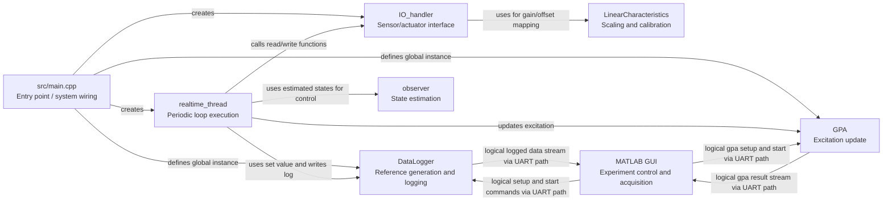
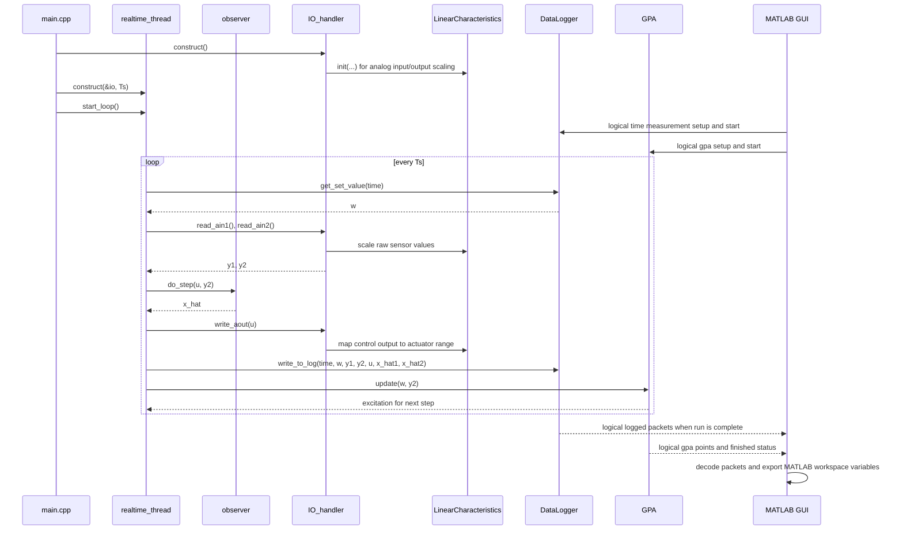

# RCRC Mbed

RCRC Mbed Project for the course Control Systems 2.

## Software Architecture (Core Modules)

### 1. Scope of the visualization

To keep the diagrams understandable, only these files/components are shown:

#### MATLAB

- `matlab/app/GPA_nucleo_UART_exported.m`

#### C++ (firmware)

- `src/main.cpp`
- `lib/GPA/GPA.*`
- `lib/DataLogger/DataLogger.*`
- `lib/IO_handler/IO_handler.*`
- `lib/realtime_thread/realtime_thread.*`
- `lib/LinearCharacteristics/LinearCharacteristics.*`
- `lib/observer/observer.*`

Not shown on purpose:

- Low-level peripherals and drivers (encoder, IMU, ESCON pin-level details)
- Mbed internals (Thread/Ticker internals, HAL)
- UART helper threads
- Eigen

### 2. What the component diagram communicates

The component diagram answers:

- Which module creates the system?
- Which module provides excitation/adaptation support?
- Which module logs data?
- Which tool starts measurements and receives experiment results?
- Which module handles hardware I/O?
- Which module runs the periodic loop?
- Which module performs scaling/calibration?
- Which module performs state estimation?

Intended interpretation:

- `main.cpp` is the entry point, wires the system together, and defines global `DataLogger` and `GPA` instances available to runtime threads.
- `GPA` is used by `realtime_thread` to compute/update excitation.
- `GPA` receives start/configuration commands through the communication path (UART helper threads hidden).
- `DataLogger` is used by `realtime_thread` to get reference values and to collect/export logged signals.
- `DataLogger` receives measurement-start and waveform parameter commands through the communication path (UART helper threads hidden).
- The MATLAB GUI is the host-side operator interface: it opens serial communication, sends experiment setup/start commands, receives logged time-series data, and reconstructs GPA FRD results in MATLAB workspace variables.
- `IO_handler` is the central interface to sensors, actuators, and analog signal handling.
- `realtime_thread` is the periodic execution unit.
- `LinearCharacteristics` is used by `IO_handler` for offset/gain conversion and scaling.
- `observer` is used by `realtime_thread` for observer-based state estimation in the control law.

### 3. MATLAB GUI purpose

The GUI implementation in `matlab/app/GPA_nucleo_UART_exported.m` is the experiment control and data acquisition front end.

Main responsibilities:

- Connect to the Nucleo board over serial (`115200` by default).
- Configure and start time-measurement runs (signal type, amplitude, frequency, offset, downsampling).
- Configure and start GPA identification runs (`f0`, `f1`, `A0`, `A1`, `N`, mode fields).
- Parse incoming framed packets, reconstruct streamed measurement data, and export MATLAB workspace variables.
- Build FRD output from GPA packets and export the identified model to workspace.

Conceptually, the GUI controls experiments and receives results. In the diagrams, GUI arrows to `DataLogger` and `GPA` mean logical interaction via the UART communication path. The UART worker threads carry bytes on the firmware side but are intentionally hidden from these high-level diagrams.

## Mermaid Diagrams

### Component Diagram (flowchart)

### Sequence Diagram

